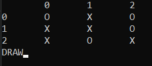

МИНИСТЕРСТВО НАУКИ  И ВЫСШЕГО ОБРАЗОВАНИЯ РОССИЙСКОЙ ФЕДЕРАЦИИ  
Федеральное государственное автономное образовательное учреждение высшего образования  
"КРЫМСКИЙ ФЕДЕРАЛЬНЫЙ УНИВЕРСИТЕТ им. В. И. ВЕРНАДСКОГО"  
ФИЗИКО-ТЕХНИЧЕСКИЙ ИНСТИТУТ  
Кафедра компьютерной инженерии и моделирования
<br/><br/>

### Отчёт по лабораторной работе №4<br/> по дисциплине "Программирование"
<br/>

студента 1 курса группы ПИ-б-о-191(1)  
Пихтиенко Дарья Владиславовна
направления подготовки 09.03.04 "Программная инженерия"  
<br/>

<table>
<tr><td>Научный руководитель<br/> старший преподаватель кафедры<br/> компьютерной инженерии и моделирования</td>
<td>(оценка)</td>
<td>Чабанов В.В.</td>
</tr>
</table>
<br/><br/>

Симферополь, 2019

## Лабораторная работа №4
Иксики-нолики\
\
**Цель:** 
1. Закрепить навыки работы с перечислениями;
2. Закрепить навыки работы с структурами;
3. Освоить методы составления многофайловых программ.
\
**Ход работы:**\
**1\.** Создаем три файла: 1) Вспомогательный файл(game.cpp), содержащий реализацию основных функций игры. 2) Заголовочный файл  для связи главного и вспомогательного файлов(game.h). 3) Файл реализующий игру «Иксики-нолики» используя функции описанные в вспомогательном файле.\
**2\.** В файле "game.cpp" реализуем функции: initGame для создания игры, updateDisplay для вывода новых ходов, botTurn и userTurn для ходов, updateGame для обновления статуса игры.\

```c++
#include <iostream>
#include "game.h"
#include <ctime>
using namespace std;


Game initGame(char userChar){
  srand(time(NULL));
    Game gra;

    gra.status=PLAY;

    for(int i=0;i<3;i++)
        for(int j=0;j<3;j++)
            gra.board[i][j]=' ';

    if((rand()%2))
       gra.isUserTurn=1;
    else
       gra.isUserTurn=0;

    gra.userChar=userChar;

    if(gra.userChar=='X')
    gra.botChar='O';
    else
      gra.botChar='X';

    return gra;
}
void updateDisplay(const Game game)
{
 system("cls");
    cout<<"\t0\t1\t2\n";
 for(int i=0;i<3;i++)
{
    cout << i << '\t';
     for(int j=0;j<3;j++)
         cout<< game.board[i][j] << '\t';
         cout << '\n';
}

}

void botTurn(Game* game){
    bool isEmpty = true;
    for (int i = 0; i < 3; i++) {
        for (int j = 0; j < 3; j++) {
            if (game->board[i][j] != ' ') isEmpty = false;
        }
    }
    if (isEmpty) {
     game->board[1][1]=game->botChar;
     return;
    }

    int kolvoX=0;
    for (int i = 0; i < 3; i++) {
         kolvoX=0;
        for (int j = 0; j < 3; j++) {
           if(game->board[i][j]==game->userChar){
               kolvoX++;
               if(kolvoX==2)
                   for(int j2=0;j2<3;j2++){
                       if(game->board[i][j2]==' '){
                           game->board[i][j2]=game->botChar;
                           return;
                       }
                   }
               }
           }
       }

    int kolvoY=0;
 for (int j = 0; j < 3; j++) {
         kolvoY=0;
    for (int i = 0; i < 3; i++) {
           if(game->board[i][j]==game->userChar){
               kolvoY++;
               if(kolvoY==2)
                   for(int i2=0;i2<3;i2++){
                       if(game->board[i2][j]==' '){
                           game->board[i2][j]=game->botChar;
                           return;
                       }
                   }
               }
           }
       }

       int main_diag=0;
     for(int i=0;i<3;i++){
         if(game->board[i][i]==game->userChar){
             main_diag++;
             if(main_diag==2){
                 for(int i2=0;i2<3;i2++){
                     if(game->board[i2][i2]==' '){
                         game->board[i2][i2]=game->botChar;
                         return;
                     }
                 }
             }
         }
     }

 int dop_diag=0;
for(int i=0;i<3;i++){
   if(game->board[i][2-i]==game->userChar){
       dop_diag++;
       if(dop_diag==2){
           for(int i2=0;i2<3;i2++){
               if(game->board[i2][2-i2]==' '){
                   game->board[i2][2-i2]=game->botChar;
                   return;
               }
           }
       }
   }
}

    //Random
    int rRow;
    int rCol;
    do{
        rRow = rand() % 3;
        rCol = rand() % 3;
    }
    while (game->board[rRow][rCol] != ' ');
    game->board[rRow][rCol] = game->botChar;
}

void userTurn(Game* game){
    while(true){
        cout<<"X Y: ";
        int x,y;
        cin>>x>>y;

        if((x<0 || x>2)||(y<0 || y>2)|| (game->board[x][y]!=' ')){
            cout<<"Error.\n";
            continue;
        }

        game->board[x][y]=game->userChar;
        break;
    }
}
bool updateGame(Game* game){
    game->isUserTurn=!game->isUserTurn;
        int user_rows[3] = {0,0,0};
        int user_cols[3] = {0,0,0};
        int user_diags[2] = {0,0}; // 0 - главная, 1 - побочная

        int bot_rows[3] = {0,0,0};
        int bot_cols[3] = {0,0,0};
        int bot_diags[2] = {0,0}; // 0 - главная, 1 - побочная


        for (int i = 0; i < 3; i++) {
            for (int j = 0; j < 3; j++) {
                if (game->board[i][j] == game->userChar) {
                    user_rows[i]++;
                    user_cols[j]++;
                    if (i == j) user_diags[0]++;
                    if (i == 2 - j) user_diags[1]++;

                    if (user_rows[i] == 3 || user_cols[j] == 3 || user_diags[0] == 3 || user_diags[1] == 3) {
                       game->status = USER_WIN;
                        return true;
                    }
                }
                else if (game->board[i][j] == game->botChar) {
                    bot_rows[i]++;
                    bot_cols[j]++;
                    if (i == j) bot_diags[0]++;
                    if (i == 2 - j) bot_diags[1]++;
                        game->status = BOT_WIN;
                    if (bot_rows[i] == 3 || bot_cols[j] == 3 || bot_diags[0] == 3 || bot_diags[1] == 3) {

                        return true;
                    }
                }
            }
            }
            // Проверка на ничью
                bool isDraw = true;
                for (int i = 0; i < 3; i++) {
                    for (int j = 0; j < 3; j++) {
                        if (game->board[i][j] == ' ') isDraw = false;
                    }
                }
                if (isDraw) {
                    game->status = NOT_WIN;
                    return true;
                }
    return false;
}

```
**3\.** В файле "game.h" создаем прототипы функций, реализованных в "game.cpp"\

```c++
#ifndef GAME_H
#define GAME_H

enum Status {
   PLAY,            // Игра продолжается
   USER_WIN,        // Игрок победил
   BOT_WIN,         // Бот победил
   NOT_WIN          // Ничья. Победителя нет, но и на поле нет свободной ячейки
};
struct Game{
   char board[3][3];  // Игровое поле
   bool isUserTurn;  // Чей ход. Если пользователя, то isUserTurn = true
   char userChar;    // Символ которым играет пользователь
   char botChar;     // Символ которым играет бот
   Status status;
};

Game initGame(char userChar);

void updateDisplay(const Game game);

void botTurn(Game* game);

void userTurn(Game* game);

bool updateGame(Game* game);
#endif // GAME_H

```
**4\.** В функции main в главном файле реализуем игру с помощью написанных ранее функций\

```c++
#include <iostream>
#include "game.h"
using namespace std;

int main()
{
    Game gra=initGame('X');
    updateDisplay(gra);

while(true){
    updateDisplay(gra);
    if (gra.isUserTurn)
        userTurn(&gra);
    else
        botTurn(&gra);
    updateDisplay(gra);

    if (updateGame(&gra)==true)
       break;
}

    switch(gra.status)
    {
    case BOT_WIN:
        cout<<"BOT WIN";
        break;
    case USER_WIN:
        cout<<"USER WIN";
        break;
    case NOT_WIN:
        cout<<"DRAW";
        break;
    default:
        cout<<"ERROR";
        break;
    }
 return 0;
}

```

\
*рис.1: Результат отработки программы*\
\
**Вывод:** В ходе выполнения данной лабораторной работы приобрела навыки работы с многофайловыми программами и закрепила навыки работы со структурами и перечислениями.
